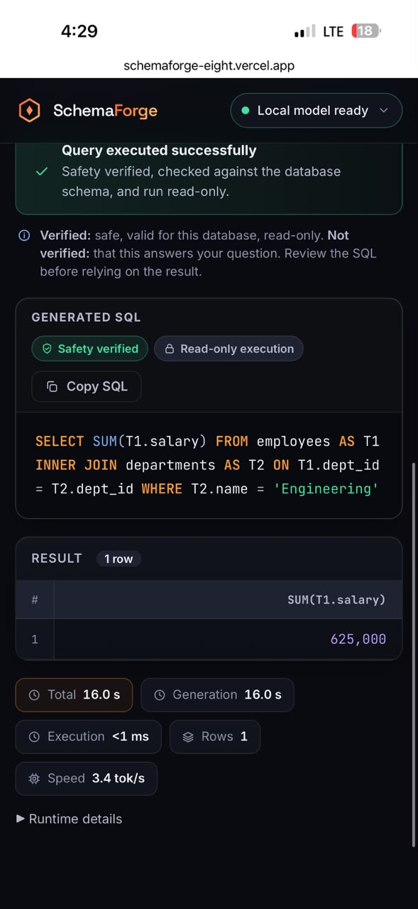

# SchemaForge (LocalSQL)

SchemaForge (repository/package name `localsql`) is a capstone project exploring whether a compact, open-weight LLM
can be fine-tuned (QLoRA) into a reliable, schema-generalizing Text-to-SQL
model: given a natural-language question, a relational database schema, and
optional business context, produce one executable, read-only SQL query.

## Research question

Can a ~4B-parameter open model, fine-tuned with 4-bit QLoRA on a filtered
slice of the BIRD training set, generate correct SQL for **database schemas
it never saw during training** -- and does giving it optional business
context (vs. schema alone) meaningfully change accuracy? Answering this
requires a training-data pipeline that splits by database (not by example)
and treats business context as something to sometimes withhold, not always
provide. Measured results are documented per phase and are not restated in
this README: the untouched-baseline result is in `docs/BASELINE.md`, the
fine-tuning/evaluation journal is `PROJECT.md`, and quantization/deployment
measurements are in `docs/PHASE7.md`.

## End-to-end scope and production deployment

This is a full model-engineering pipeline, not just a UI over an API:

```text
BIRD data -> QLoRA fine-tune (open-weight Qwen3-4B) -> benchmark evaluation
  -> GGUF Q4_K_M quantization -> persistent llama.cpp serving
  -> deterministic SQL safety + preflight + read-only execution
  -> Docker -> AWS EC2 (HTTPS) -> Vercel frontend
```

**Phase 11 proved the whole stack on real public infrastructure** (2026-09-19):

- **Model:** open-weight `Qwen3-4B-Instruct-2507`, QLoRA-specialized (checkpoint-1518), served as
  a Q4_K_M base + hot-loaded F16 LoRA (~2.39 GB effective) by a **persistent, private llama.cpp
  server** -- loaded once, not per request.
- **Safety:** every generated statement passes a deterministic AST safety policy and a
  database-aware preflight, then runs on an independent **read-only** SQLite executor.
- **Deployment:** Docker Compose on one AWS EC2 host (`m7i-flex.large`, 2 vCPU, 8 GiB, **CPU-only**):
  Caddy (automatic HTTPS) -> FastAPI -> private llama.cpp server. Only application ports 80/443 were internet-facing (SSH 22 was
  restricted to the operator's IP), the model server is on an internal Docker network, CORS is an exact-origin allow-list, and model
  artifacts are mounted read-only and SHA-256 verified.
- **Frontend:** static Vite SPA on Vercel calling the HTTPS backend.
- **External validation:** an iPhone on **LTE with Wi-Fi off** ran a real natural-language query
  end to end and got the correct result from the read-only demo database.

<p align="center">
  
</p>

<sub>Real screenshot from the proof (single request: 16.0 s, 3.4 tok/s on 2 vCPU -- an observation, **not a benchmark**).</sub>

**Honest framing.** The AWS host was an **ephemeral proof deployment**: the EC2 instance was terminated after the
final evidence was captured and is not running now. The static Vercel frontend may remain deployed but cannot serve queries without a recreated backend. The `98-93-31-228.sslip.io` backend name in the
evidence is **retired**. The system can be recreated from the checked-in runbook. The deterministic
checks establish that SQL is safe, valid and read-only -- **not** that it answers the question
correctly; confidence is intentionally not claimed. V1 is SQLite-first with one demo database.
Deployment validation is kept separate from the research benchmarks above.

- Evidence record: [`docs/evidence/phase11-production-proof.md`](docs/evidence/phase11-production-proof.md)
- Architecture, security controls, runbook, limitations: [`docs/PHASE11.md`](docs/PHASE11.md)

## Architecture (high level)

```text
Offline ML:   BIRD --> prepare --> baseline --> QLoRA --> evaluate --> quantize
Production:   question --> schema introspection --> fine-tuned model
                --> SQL safety validation --> read-only execution --> result
```

See `docs/ARCHITECTURE.md` for the full plan, `docs/DATA_CONTRACT.md` for
the training-data pipeline, `docs/EVALUATION.md` for the benchmark,
`docs/BASELINE.md` for baseline inference, and `docs/TRAINING.md` for the
QLoRA smoke test. `PROJECT.md` is the full chronological engineering
journal.

## Status: Phases 1-11 complete

| Phase | Scope | Where |
|---|---|---|
| 1-2 | Reproducible BIRD training-data pipeline; locked BIRD Mini-Dev evaluation system | `docs/DATA_CONTRACT.md`, `docs/EVALUATION.md` |
| 3 | Untouched-baseline inference (real Kaggle result: official EX 43.6, Soft-F1 47.6975) | `docs/BASELINE.md` |
| 4 | QLoRA smoke test (details below) | `docs/TRAINING.md` |
| 5-6 | Schema-context strategy, full QLoRA training (checkpoint-1518), fine-tuned evaluation | `PROJECT.md`, `docs/CONTEXT_BUDGET.md` |
| 7 | GGUF Q4_K_M quantization + local llama.cpp inference | `docs/PHASE7.md` |
| 8-10 | Production backend, product frontend, reliability/hardening | `docs/PHASE8.md`, `docs/PHASE9.md`, `docs/PHASE10.md` |
| 11 | Persistent serving, Docker, real AWS + Vercel deployment proof | `docs/PHASE11.md`, `docs/evidence/phase11-production-proof.md` |

The sections below are the original Phase 1-4 detail, kept as written (a historical snapshot;
`PROJECT.md` is the authoritative journal for later phases).

Phase 3's real Kaggle baseline: official EX 43.6, Soft-F1 47.6975. Phase 4's
real Kaggle QLoRA smoke test: 20/20 steps, final loss 0.410, adapter saved
and reload-verified.

**Phase 1 -- reproducible training-data pipeline**
- Loads the real `birdsql/bird23-train-filtered` dataset (6,601 rows / 69
  databases).
- Sources official BIRD schema metadata and merges in column descriptions.
- Deterministically serializes each database schema and builds the single
  canonical prompt/completion pair every later phase reuses.
- Splits by `db_id` (90/10 by default), zero leakage enforced in code.
- Deterministic, seedable dropout of BIRD's `evidence` field.
- Validates every row explicitly -- nothing is silently dropped.

**Phase 2 -- external BIRD Mini-Dev evaluation system**
- Sets up the official, locked **original 500 SELECT-only SQLite** Mini-Dev
  benchmark (11 databases) -- explicitly not the newer Mini-Dev V2 /
  LiveSQLBench CRUD additions.
- Builds a gold-free generation manifest (reusing the Phase 1 schema
  serializer and prompt builder) and an isolated grading reference, joined
  by stable `example_id`s -- gold SQL never appears in the generation-side
  artifact (enforced in code and tested).
- Integrates the unmodified, pinned-commit official EX and Soft-F1
  evaluators; adds LocalSQL-only diagnostics (SQL parse rate, execution
  success rate) that are never conflated with official correctness.
- R-VES is deferred until deployment hardware is fixed.

**Phase 3 -- baseline inference infrastructure (COMPLETE)**
- Implements a single Qwen3-4B-Instruct-2507 (untouched, 4-bit NF4) backend
  and a resumable runner that reads *only* the Phase 2 gold-free
  generation manifest.
- Reuses the Phase 1 canonical prompt verbatim as a single chat message,
  wrapped only by Qwen's own chat template.
- Deterministic decoding; raw completions preserved; `predicted_sql` is
  whitespace-trimmed only, never repaired.
- Full model/software/hardware provenance recorded per run; safe
  crash-resume; `--dry-run` validates everything without CUDA/model deps.
- **Real result (Kaggle)**: official EX 43.6, Soft-F1 47.6975, 500/500
  generated, 0 failures. See `docs/BASELINE.md` / `PROJECT.md`.

**Phase 4 -- QLoRA smoke test (COMPLETE)**
- Reuses Phase 1's `train.jsonl` verbatim (prompt/completion/evidence
  dropout already baked in) -- never re-split or re-derived.
- Explicit, unit-tested completion-only loss masking (prompt tokens
  label `-100`, only gold-SQL completion tokens trainable) -- validated
  with 0 prefix mismatches against the real Qwen tokenizer over all 6,067
  training examples.
- **Real Kaggle result**: 200-example/20-step smoke run, all steps
  completed, final loss 0.410, peak GPU memory 11,550.2 MB, adapter saved
  and reload-verified. See `docs/TRAINING.md` / `PROJECT.md`.
- **Real token profile (6,067 examples)**: 1,398 (~23%) exceed 4096
  tokens, 539 (~8.9%) exceed 8192, concentrated in 2 schema-heavy
  databases. **Neither limit is approved for Phase 5 full training** --
  the context-length/schema strategy is an explicit open decision.

*(Phase 1-4 snapshot ends here; later phases are summarized in the status table above.)*

## Setup

Requires Python 3.11 and [`uv`](https://docs.astral.sh/uv/).

```powershell
uv sync
uv sync --group eval                   # only needed to run the official BIRD evaluator
uv sync --group model                  # only on a CUDA cloud machine (baseline)
uv sync --group model --group train    # only on a CUDA cloud machine (QLoRA smoke test)
```

## Commands

```powershell
# Phase 1: inspect / prepare BIRD training data
uv run python scripts/inspect_bird.py
uv run python scripts/prepare_bird.py

# Phase 2: set up / evaluate against BIRD Mini-Dev
uv run python scripts/setup_bird_minidev.py
uv run python scripts/evaluate_bird_minidev.py --predictions path\to\predictions.jsonl

# Phase 3: baseline inference (dry-run needs no GPU/model deps)
uv run python scripts/run_baseline.py --manifest data\benchmarks\bird_mini_dev\generation\manifest.jsonl --run-id qwen3-4b-base-nf4-smoke --dry-run --limit 5

# Phase 4: QLoRA smoke test (dry-run/token-profile need no CUDA where noted)
uv run python scripts/run_qlora_smoke.py --run-id qlora-smoke-check --dry-run --max-train-examples 50

# Run tests (no network required)
uv run pytest -q
```

## Running the production stack

```bash
cp deploy/production.env.example .env     # set domain, exact CORS origin, model dir, LLAMA_THREADS
docker compose up -d --build              # Caddy + FastAPI + private llama.cpp server (CPU by default)
bash deploy/aws/verify_stack.sh https://<your-domain>
```

Model files are supplied by mounted volume, never by Git or the image. Full procedure, sizing,
security group, teardown: [`docs/PHASE11.md`](docs/PHASE11.md#7-deployment-runbook-as-actually-performed).

## Project layout

```text
PROJECT.md                Chronological engineering journal (all phases)
configs/data.yaml         Phase 1 pipeline constants
configs/benchmark.yaml    Phase 2 benchmark constants
configs/model.yaml        Phase 3 baseline model/runtime constants
configs/train.yaml        Phase 4 QLoRA smoke-test constants
src/localsql/data/        Phase 1: typed models, loaders, serializer,
                           prompt builder, splitter, validator
src/localsql/benchmark/   Phase 2: Mini-Dev loader, manifest builder,
                           prediction contract, diagnostics, official
                           evaluator adapter, report assembly
src/localsql/model/       Phase 3: model config, Qwen backend, generation
                           envelope/orchestration, run artifacts/resume
src/localsql/train/       Phase 4: train config, SFT data/completion-only
                           masking, QLoRA backend
scripts/                  inspect_bird.py, prepare_bird.py,
                           setup_bird_minidev.py, evaluate_bird_minidev.py,
                           run_baseline.py, run_qlora_smoke.py
tests/                    Unit + fixture-based tests
docs/                     ARCHITECTURE.md, DATA_CONTRACT.md, EVALUATION.md,
                           BASELINE.md, TRAINING.md, PHASE7-11.md,
                           evidence/ (Phase 11 production proof), assets/
src/localsql/backend/     Phases 8-11: QueryService, safety, preflight, read-only
                           executor, FastAPI, persistent llama.cpp runtime
frontend/                 Phase 9: Vite + React SPA (deployed on Vercel)
docker/, deploy/          Phase 11: Dockerfiles, Caddyfile, env template, EC2 scripts
docker-compose*.yml       Phase 11: production stack, local and optional GPU overlays
data/                     raw/ processed/ benchmarks/ runs/ (gitignored)
```
