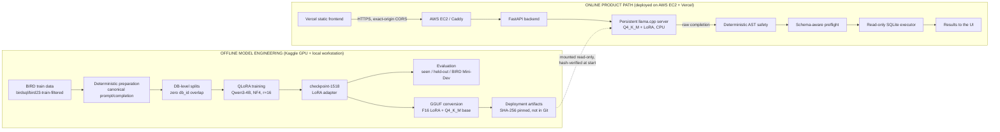

# SchemaForge Architecture

SchemaForge (repository/package name `localsql`) is a finished system with two halves: an
**offline model-engineering pipeline** that produced a frozen model, and an **online product
path** that serves it safely. This document describes the finished system; the per-phase
design detail lives in the linked phase documents, and [`../PROJECT.md`](../PROJECT.md) is the
chronological engineering journal.

## System overview



## Offline model engineering

| Stage | What happens | Authoritative doc |
|---|---|---|
| Data | `birdsql/bird23-train-filtered` + official BIRD schema metadata -> one canonical prompt/completion per example; BIRD `evidence` (business context) is sometimes withheld by seeded dropout | [`DATA_CONTRACT.md`](DATA_CONTRACT.md) |
| Splits | By `db_id`, never by example; zero overlap asserted in code | [`DATA_CONTRACT.md`](DATA_CONTRACT.md) |
| Evaluation engine | Locked BIRD Mini-Dev (500 SELECT-only SQLite examples, 11 DBs); gold isolated from generation; official evaluator vendored unmodified | [`EVALUATION.md`](EVALUATION.md) |
| Baseline | Untouched Qwen3-4B, 4-bit NF4, canonical prompt | [`BASELINE.md`](BASELINE.md) |
| Context strategy | Adaptive per-database schema compaction so every training example fits `max_seq_length=4096` with zero truncation | [`CONTEXT_BUDGET.md`](CONTEXT_BUDGET.md) |
| Training | 4-bit QLoRA (NF4, double-quant, FP16 compute), LoRA r=16/alpha=32 on all 7 projections, completion-only loss, 2 epochs = 1,518 steps -> `checkpoint-1518` | [`TRAINING.md`](TRAINING.md) |
| Results | Seen-training specialization; schema-held-out generalization; external Mini-Dev | [`RESULTS.md`](RESULTS.md) |
| Quantization | HF base -> F16 GGUF -> **Q4_K_M** (~2.33 GB); adapter -> F16 LoRA GGUF (~0.06 GB); served as base + hot LoRA (~2.39 GB effective) | [`PHASE7.md`](PHASE7.md) |

Training-time NF4 and deployment-time Q4_K_M are different quantizations. The deployed base is
numerically different from the model that was scored in [`RESULTS.md`](RESULTS.md), and no
accuracy claim is made for it.

## Online product path

```text
Browser -> Vercel (static SPA) -> HTTPS -> AWS EC2 -> Caddy -> FastAPI
        -> private persistent llama.cpp server (Qwen3-4B Q4_K_M + LoRA, CPU)
        -> deterministic SQL safety -> DB-aware preflight -> read-only SQLite executor
```

The model runs on the EC2 host, **never in the browser or on the visitor's device**. The
frontend contains no database access, SQL-safety, execution or model logic.

For each `POST /query`, `QueryService` (`src/localsql/backend/service.py`, free of FastAPI
imports) runs one pipeline: resolve the registered database -> introspect its real schema ->
build the canonical prompt with the same serializer/builder used in training and evaluation ->
`ModelRuntime.generate` -> whitespace-only normalization -> AST safety -> preflight -> read-only
execution -> `QueryResponse` (with a `reliability` block).

### Who is responsible for what

| MODEL (probabilistic) | DETERMINISTIC SOFTWARE (verifiable) |
|---|---|
| **SQL generation only.** Given question + schema + optional business context, emit one SQL statement. It does not decide whether the SQL is safe, valid or correct. | Schema introspection · prompt construction · output normalization (trim only, never repair) · SQL parsing and AST safety · single-statement enforcement · DB-aware preflight · read-only execution · timeouts · row limits · bounded concurrency · cancellation · rate limiting · request IDs / observability |

### Trust boundary

Untrusted: the user's question and business context, and **the model's output** (including
anything a prompt injection coaxes out). Everything protective is downstream of the model:

1. **AST safety policy** (`safety.py`, sqlglot): exactly one statement; root must be a
   SELECT / WITH...SELECT / set operation of selects; the whole tree is walked; DDL, DML,
   ATTACH, PRAGMA, transactions, extension loading and similar are rejected.
2. **DB-aware preflight** (`preflight.py`): the SQL must compile against *this* database's real
   schema (EXPLAIN-based); nothing runs if it does not.
3. **Independent read-only executor** (`executor.py`): SQLite `mode=ro`, `PRAGMA query_only`,
   an authorizer allowing only reads, a wall-clock timeout and a row cap. It holds even if the
   AST layer were bypassed (there is a test for exactly that).

**Safe is not correct.** These checks establish that SQL is safe, valid for the schema and
read-only. `QueryResponse.reliability.semantic_correctness` is always `"not_verified"` and
`confidence` is always `null` — deliberately unclaimed ([`PHASE10.md`](PHASE10.md)).

### Production serving and hardening

| Concern | Mechanism |
|---|---|
| Persistent model | One `llama-server` process loads Q4_K_M + hot LoRA once; requests reuse it (no ~10 s per-query reload) — [`PHASE11.md`](PHASE11.md) |
| Network | Only Caddy publishes 80/443 (automatic HTTPS, HTTP->HTTPS); model server is on an `internal: true` Docker network with no host ports and no egress |
| CORS | Exact-origin allow-list enforced at startup (no wildcard/loopback/`http://`) |
| Docs | `/docs`, `/redoc`, `/openapi.json` disabled in production |
| Readiness | `/health` (backend alive) and `/ready` (model server loaded); readiness never runs inference |
| Concurrency | Bounded `InferenceGate` (slots = server `--parallel`, small bounded wait queue; overflow -> HTTP 429 `model_busy`) |
| Cancellation / timeout | `POST /query/{id}/cancel` and a generation deadline close the stream, which aborts generation server-side and frees the slot |
| Abuse limits | Per-client rate limit on `POST /query`; Caddy 64 KB and backend `Content-Length` body caps; request IDs preserved end to end |
| Containers | Non-root, `cap_drop: ALL`, `no-new-privileges`, read-only backend rootfs, read-only model/database mounts |
| Artifact integrity | SHA-256 verification of GGUF files at every model-server start; refuses to start on mismatch |

### Serving runtimes

`SCHEMAFORGE_RUNTIME_KIND=llama_server` (persistent; used in the deployment) or `llama_cpp`
(per-query subprocess; development/fallback default). Both implement the same `ModelRuntime`
protocol, so `QueryService` is runtime-agnostic. GPU offload is configurable (`LLAMA_NGL`,
`docker-compose.gpu.yml`) but was not exercised; CPU serving is the supported, proven path.

## Deployment topology (as proven in Phase 11)

The AWS EC2 host (`m7i-flex.large`, 2 vCPU, 8 GiB, CPU-only) runs Docker Compose:
`seed-db` (one-shot demo DB) -> `model-server` (internal network) + `backend`
(internal + edge networks) -> `caddy` (edge network). The detailed diagram, runbook,
teardown/recreation strategy and limitations are in [`PHASE11.md`](PHASE11.md); the captured
proof is [`evidence/phase11-production-proof.md`](evidence/phase11-production-proof.md).

During demonstrations the AWS backend is recreated and active. The original proof instance was
terminated after evidence capture (its temporary hostname is retired); without a running
backend the static Vercel frontend cannot serve queries.

## Boundaries and scope

V1 is SQLite-first with one registered read-only demo database. There is deliberately no
PostgreSQL/bring-your-own-database support, authentication, agent framework, RAG or MCP layer
([`LIMITATIONS.md`](LIMITATIONS.md)). The one extension seam: PostgreSQL would be a new
dialect backend (introspector + executor) plus registry support, without changing
`QueryService`.

## Code map

| Path | Role |
|---|---|
| `src/localsql/data/`, `schema_context/` | Phase 1/5: loaders, serializer, prompt builder, splitter, validator, schema compaction |
| `src/localsql/benchmark/` | Phase 2: Mini-Dev setup, manifests, prediction contract, official-evaluator adapter, diagnostics |
| `src/localsql/model/`, `train/` | Phase 3-5: baseline/fine-tuned inference backend, QLoRA training, resume, export (lazy heavy imports) |
| `src/localsql/deploy/` | Phase 7: GGUF conversion, manifests, local runtime |
| `src/localsql/backend/` | Phase 8-11: registry, introspection, safety, preflight, executor, runtimes, service, FastAPI |
| `frontend/` | Phase 9-11: Vite + React + TypeScript SPA (Vercel) |
| `docker/`, `deploy/`, `docker-compose*.yml` | Phase 11: images, Caddyfile, env template, EC2 scripts |
