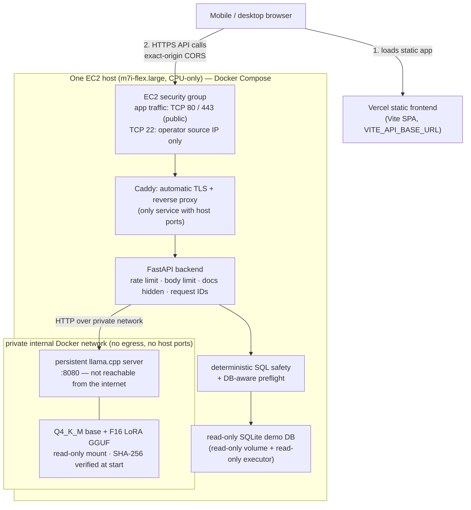

# Phase 11 — Persistent serving, containerization, cloud-deployment readiness

Phases 1–10 are frozen. Phase 11 changes **how the model is served and shipped**, not what it
does: same frozen Q4_K_M base + hot LoRA (checkpoint-1518), same canonical prompt, same
normalization, safety, preflight and read-only execution.

```
before   query → launch llama.cpp → load 2.4 GB model → generate → exit      (~10 s reload per query)
now      llama-server started once → Q4_K_M + LoRA resident → many requests  (HTTP, model stays loaded)

Vercel (static SPA) ─HTTPS→ Caddy ─→ FastAPI backend ─HTTP (private net)→ llama-server
                                     │                                      └ /models (ro): Q4_K_M + LoRA GGUF
                                     └ registered demo SQLite DB (ro volume + read-only executor)
```

**Status: PASSED — both gates.**

| Gate | Result |
|---|---|
| Implementation gate (local) | **Passed.** Persistent runtime, Docker/Compose, readiness/concurrency/cancellation verified against a real `llama-server`; `uv run pytest -q` green; `scripts/canary_phase11.py` passed (§8). |
| Remote production gate | **Passed** on 2026-09-19: Vercel frontend → public HTTPS AWS EC2 backend (Caddy) → private persistent llama.cpp server (Q4_K_M + LoRA) → safe SQL → correct result, exercised from an iPhone on LTE with Wi-Fi off. Evidence: [`docs/evidence/phase11-production-proof.md`](evidence/phase11-production-proof.md). Deployed commit `d51d36a98183353b42e0f73d550723028bce1d64`. |
| Teardown | **Completed.** The EC2 proof instance was terminated after the final evidence capture (2026-09-19 23:55:16 UTC); the temporary `98-93-31-228.sslip.io` backend is retired. The static Vercel frontend may remain deployed but cannot serve model queries without a recreated backend. Recreate from §7. |

This is deployment validation, **not** a benchmark: the single production request (16.0 s,
3.4 tok/s, CPU-only 2 vCPU) is an illustrative observation, and no research result was changed
or re-measured in this phase.

## Architecture as proven



**Design rationale.**
* *Persistent server, not process-per-query* — the ~2.4 GB model loads once instead of on every
  request; the ~10 s reload of Phase 8–10 disappears from the request path.
* *llama.cpp, not vLLM* — it serves the exact frozen GGUF artifacts (Q4_K_M base + hot LoRA)
  measured in Phase 7, runs on CPU, and keeps GPU offload optional (`LLAMA_NGL`).
* *The backend is the only application boundary* — the model never sees the internet and never
  touches the database; every generated statement passes the deterministic safety policy and
  preflight before a read-only executor runs it.
* *One small host, short-lived* — cost and reproducibility over latency.
* *Static frontend on Vercel* — no server-side hop; the browser calls the backend directly, which
  is why exact-origin CORS and TLS on the backend matter.

**Container topology.** `seed-db` (one-shot, no network) → `model-server` (internal network only)
+ `backend` (internal + edge networks) → `caddy` (edge network, publishes 80/443). Details in §5.

**Security controls (all implemented in this repository; see §5–§6 and the evidence record for what was observed):**
HTTPS with automatic certificates and HTTP→HTTPS redirect; only application ports 80/443 internet-facing (SSH 22 restricted to the operator's IP); only Caddy publishes host ports; model
server on an `internal: true` network with no `ports:`; exact-origin production CORS enforced at
startup (no wildcard); `/docs` disabled; per-client rate limit and body limits; Caddy as the sole
trusted proxy hop; non-root images; dropped Linux capabilities; `no-new-privileges`; read-only
backend root filesystem and read-only model/database mounts; SHA-256 verification of model
artifacts before serving; deterministic read-only SQL execution.

**Configuration used for the proof** (`deploy/production.env.example` is the template):
`LLAMA_NGL=0`, `LLAMA_THREADS=2`, `LLAMA_PARALLEL=1`, `LLAMA_CTX=8192`, `MODEL_TIMEOUT_SECONDS=240`,
`VERIFY_SHA256=1`, `SCHEMAFORGE_ENV=production`, exact Vercel origin in `SCHEMAFORGE_CORS_ORIGINS`;
frontend built with `VITE_API_BASE_URL` = the HTTPS backend and `VITE_QUERY_TIMEOUT_MS=300000`
(deliberately above the backend's 240 s so the backend gives up first).

## 1. Persistent llama.cpp runtime

`localsql/backend/server_runtime.py::LlamaServerRuntime` implements the same `ModelRuntime`
protocol as the Phase 8 subprocess runtime, so `QueryService` is unchanged and runtime-agnostic.

* `POST /completion` on `llama-server`, **streamed** (SSE). Greedy: `temperature 0, top_k 1`,
  `seed 42`, `n_predict 512`, `cache_prompt false` (deterministic cold prefill by default; enable
  in `configs/backend.yaml → runtime.server.cache_prompt` for speed at the cost of bit-identity).
  Context/tokens/seed come from `configs/phase7.yaml`, exactly as for the subprocess runtime.
* `raw_completion` is returned untouched; `normalize_predicted_sql` stays in `QueryService`.
* Metrics recorded from llama.cpp's own final chunk: prompt/generated tokens, tokens/sec,
  server prompt/generation ms, `stop_type` — `null`/absent when the server does not report them.
* Failures map onto the existing taxonomy (no new codes): unreachable/malformed/HTTP error →
  `model_error`; deadline → `model_timeout`; full gate → `model_busy`; cancelled → `cancelled`.
  Internal reasons (`server_unreachable`, `malformed_response`, `incomplete_stream`, `http_status`…)
  go to the log only; API messages stay generic and never contain the server URL or paths.

### Runtime selection

| Setting | Meaning |
|---|---|
| `SCHEMAFORGE_RUNTIME_KIND` (or `runtime.kind`) | `llama_server` (persistent, production) · `llama_cpp` (subprocess; **development/fallback, still default**) |
| `SCHEMAFORGE_LLAMA_SERVER_URL` | private URL, e.g. `http://model-server:8080`. Never committed. Missing → `model_not_configured` (service still starts) |
| `SCHEMAFORGE_LLAMA_PARALLEL` | server slots = backend inference concurrency (default 1) |
| `SCHEMAFORGE_MODEL_TIMEOUT_SECONDS` | per-request generation limit (default `runtime.timeout_seconds` = 120; compose uses 240) |
| `SCHEMAFORGE_LLAMA_NGL` | informational GPU-layer count for `/health`; the real offload flag is on the server |

The subprocess `LlamaCppRuntime` and its Phase 10 controls (gate, kill-on-cancel, Phase 8
trailing-newline guard) are untouched.

## 2. Prompt / output parity

Both runtimes wrap the canonical prompt in the same ChatML envelope
(`build_chatml_prompt`) ending `assistant\n`. `llama-completion -f` strips one trailing newline
(the Phase 8 drift), so the subprocess runtime writes one extra; the server receives the string
verbatim. `tests/backend/test_phase11_serving.py` pins:
`subprocess prompt-file text == server prompt + "\n"`, that the server prompt ends
`<|im_start|>assistant\n`, that both runtimes receive the identical canonical prompt from
`QueryService`, and that generation settings equal the Phase 7 config. The local canary shows the
same SQL/answers as Phase 10's three fixture queries.

## 3. Concurrency, cancellation, readiness

* **Bounded concurrency.** `InferenceGate(slots, max_waiting=2, wait=20 s)` — concurrency equals
  the server's `--parallel` slots (not hard-wired to 1 because there is no per-request model
  load any more), the wait queue stays bounded, overflow is rejected immediately (`model_busy`,
  HTTP 429 + `Retry-After`). The entrypoint sets `-c CTX×PARALLEL` so every slot keeps the full
  8192 context. Keep `PARALLEL=1` on CPU: extra slots multiply KV memory without adding throughput.
* **Cancellation / timeout.** The stream is read on a worker thread and polled every 100 ms;
  on `POST /query/{id}/cancel` or deadline the HTTP response/connection is closed, which makes
  llama-server abort generation and free the slot. Real-server canary: cancelled in ~80 ms, `/slots`
  idle afterwards, next query succeeds on the same process.
* **Readiness never runs inference.** `GET /health` on the server (200 ready / 503 loading),
  cached 1 s. `/ready` and `/health` add a `serving` block:
  `state ∈ ready | busy | saturated | loading | unreachable`, and
  `checks{server_configured, server_reachable, model_ready}`. `/ready` is 503 with reasons
  `model_server_loading` / `model_server_unreachable`; `/health` stays 200 (backend alive) even
  when the model server is down. No URL, path or prompt is ever exposed. The canary verifies
  server token counters are still 0 after readiness/health polling.
* One uvicorn worker on purpose: the gate and rate limiter are per-process.

## 4. Observability

JSON-line events (existing logger, existing forbidden-field filter — no prompts, rows, paths, URLs):
`runtime.generated` (mode, `queue_wait_ms`, `generation_latency_ms`, tokens, tokens/sec, stop type),
`runtime.timeout`, `runtime.cancelled`, `runtime.saturated` (gate snapshot), `runtime.failure`
(reason), `runtime.server_state` (only on state transitions), `api.rate_limited`, plus the existing
`query.completed` (total backend latency + per-stage timings). The same numbers are in the
response's `model` block. The model server exposes Prometheus counters on its private `/metrics`
(`--metrics`); nothing heavier is added.

## 5. Docker

| File | Purpose |
|---|---|
| `docker/backend.Dockerfile` | python 3.11-slim, `uv sync --frozen --no-dev`, non-root uid 10001, healthcheck, 1 uvicorn worker. No weights inside. |
| `docker/model-server.Dockerfile` + `model-server-entrypoint.sh` | pinned `ghcr.io/ggml-org/llama.cpp:server-b10964` (the Phase 7 build), non-root, env-driven launch, optional `SHA256SUMS` verification (refuses to start on mismatch), `--cache-ram 0`, `--metrics`, healthcheck (`/health`). |
| `docker-compose.yml` | production stack: `seed-db` (one-shot demo DB), `model-server`, `backend`, `caddy`. Only Caddy publishes ports (80/443). |
| `docker-compose.local.yml` | local validation: publishes the backend on loopback, development CORS, optional `frontend` profile (nginx). |
| `docker-compose.gpu.yml` | **optional** CUDA overlay (`server-cuda-b10964`, `LLAMA_NGL=99`, NVIDIA device reservation). |
| `deploy/Caddyfile` | automatic HTTPS, 64 KB body cap, HSTS, `X-Forwarded-For` set by Caddy. |
| `deploy/production.env.example` | every knob, no secrets. (Not named `.env.*` — the repo ignores those.) |
| `.dockerignore` | keeps `.git`, `.artifacts`, `*.gguf`, `data/`, notebooks, zips, `node_modules` out of every build context. |

Hardening: no `privileged`; `cap_drop: ALL`; `no-new-privileges`; backend `read_only: true`
rootfs and the SQLite volume mounted `:ro`; models mounted `:ro`; the `model` network is
`internal: true` (no egress, no host route) and only backend + model-server join it; the model
server has no `ports:`. Verified locally: the backend reaches `model-server:8080`; the model server
has no outbound route; nothing on the host answers on the model-server port; writes to `/app` and
`/data/databases` fail. Compose refuses to start without `SCHEMAFORGE_CORS_ORIGINS`,
`SCHEMAFORGE_DOMAIN`, `MODEL_DIR`, `BASE_GGUF_NAME`, `LORA_GGUF_NAME`.

Local run:
```bash
export MODEL_DIR=/path/to/dir BASE_GGUF_NAME=base-Q4_K_M.gguf LORA_GGUF_NAME=lora-1518-f16.gguf LLAMA_THREADS=6
export SCHEMAFORGE_DOMAIN=unused SCHEMAFORGE_CORS_ORIGINS=http://localhost:5173
docker compose -f docker-compose.yml -f docker-compose.local.yml up -d --build seed-db model-server backend
curl localhost:8000/ready
```

### CPU thread count matters (measured)

`-t -1` uses every logical CPU. On a shared/SMT machine (Docker Desktop, 12 logical CPUs) that
gave **0.4 tokens/s**; `LLAMA_THREADS=6` gave **~12 tokens/s** for the same model. Always set
`LLAMA_THREADS` to the physical-core / vCPU count of the host and check `runtime.generated` logs.
On a 2-vCPU EC2 instance use `LLAMA_THREADS=2`.

## 6. Public networking (Vercel → HTTPS backend → private model)

* **Frontend:** `VITE_API_BASE_URL` (Vercel env var). A *production* build now **fails** if it is
  unset instead of baking in `127.0.0.1` (`frontend/vite.config.ts`); local dev is unchanged.
  `frontend/vercel.json` adds the SPA rewrite and basic headers; `frontend/env.production.example`.
* **CORS:** `SCHEMAFORGE_ENV=production` makes the backend **fail at startup** unless
  `SCHEMAFORGE_CORS_ORIGINS` is an explicit list of `https://` origins (no `*`, no loopback, no
  path). `/docs`, `/redoc`, `/openapi.json` are disabled in production. Vercel *preview* URLs are
  not allowed unless you list them; use the production URL or a custom domain.
* **Request limits:** Caddy caps bodies at 64 KB; the backend refuses a declared
  `Content-Length` > `SCHEMAFORGE_MAX_BODY_BYTES` (413 `payload_too_large`).
* **Rate limit:** in-process sliding window per client on `POST /query` only
  (`SCHEMAFORGE_RATE_LIMIT_PER_MINUTE`, compose default 20; 429 `rate_limited` + `Retry-After`; the
  frontend shows a friendly "too many requests"). Memory-bounded. Not distributed, not auth.
* **Proxy headers:** the client identity is `X-Forwarded-For[-hops]` with
  `SCHEMAFORGE_TRUSTED_PROXY_HOPS=1` (Caddy overwrites client-supplied values); with 0 hops the
  header is ignored entirely so it cannot be spoofed. `X-Request-ID` is preserved end to end.
* The model server is never internet-facing; the backend is the only application boundary.

## 7. Deployment runbook (as actually performed)

Single EC2 host, CPU, zero-cost intent. Nothing in the repository creates AWS resources or reads
AWS credentials; every step below is manual. Order: deploy → prove → save evidence → terminate.
No secrets belong in this procedure — the stack needs none; never paste key material or tokens into
docs, `.env` examples or commits.

**Host used for the proof:** `m7i-flex.large` (2 vCPU, 8 GiB), Ubuntu Server 26.04 LTS x86_64,
30 GiB gp3 root volume, us-east-1, IMDSv2 required, no GPU, no NAT gateway / load balancer / RDS /
Route 53 zone / Elastic IP. (Ubuntu 24.04 and Amazon Linux 2023 are also supported by
`bootstrap_ec2.sh`; the first is what the script was written against, 26.04 is what was proven.)

**Sizing.** The model-server container held **3.66 GiB** at the proof snapshot (Q4_K_M + LoRA, 8192
context, 1 slot; ~2.9 GiB in the earlier local canary), with the backend at ~60 MiB and Caddy
~12 MiB. Use **≥ 8 GiB RAM, 2+ vCPU, 30 GB gp3, x86_64** (the pinned llama.cpp image is amd64 in
this runbook). 1–2 GiB instance types cannot hold the model and 4 GiB is marginal. Which instance
types your Free Tier / credits cover changes over time and this repository cannot verify it —
check the console, and if no 8 GiB type is covered, stop rather than pay. With 2 vCPU expect a few
tokens/s; the proof observed 3.4 tok/s on one request.

**Security group:** inbound TCP 80 and 443 from anywhere; TCP 22 **only from your own IP** (or use
SSM Session Manager and open no SSH). Nothing else — 8000 and 8080 must stay closed.

**Hostname / TLS options (all free):** (a) `<ip-with-dashes>.sslip.io` (e.g. `203-0-113-10.sslip.io`)
— a real DNS name for the host's public IPv4; Let's Encrypt issues for it with no registration (used
for the proof; the name changes if the IP changes, so it is inherently temporary); (b) a DuckDNS
subdomain; (c) your own domain with an A record. Use the value as `SCHEMAFORGE_DOMAIN`; Caddy
obtains and renews the certificate automatically (ports 80 and 443 must be reachable).

1. **Launch** the instance with the security group above and require IMDSv2.
2. **Bootstrap:** copy `deploy/aws/bootstrap_ec2.sh` to the host and run it (Docker Engine +
   Compose plugin, 4 GB swap as an OOM safety net, creates `/opt/schemaforge/models`). Log out and
   back in so the `docker` group applies.
3. **Code:** `git clone` the repository at the commit you intend to deploy (the proof used
   `d51d36a`) — no model files are in Git.
4. **Model artifacts** (~2.56 GB; plain `scp` is the simplest secure method — no storage service
   is needed). On the workstation:
   ```bash
   uv run python scripts/phase11_model_manifest.py --base base-Q4_K_M.gguf --lora lora-1518-f16.gguf --out-dir ./model-bundle
   scp -i <key> base-Q4_K_M.gguf lora-1518-f16.gguf model-bundle/SHA256SUMS <user>@<host>:/opt/schemaforge/models/
   ```
   Expected digests (Phase 7 frozen artifacts):
   `base-Q4_K_M.gguf` `3df3d5bfa7290f20e8b0ad2b9bae78aa06fb198b97837e4ebc28b5867851c848`,
   `lora-1518-f16.gguf` `53ee2c6dd036ebcccdf0c71bf682c961244ca4665e0cc53bd809ac98b944ba48`.
   **Manual verification must run inside the models directory** (the manifest lists bare names):
   `cd /opt/schemaforge/models && sha256sum -c SHA256SUMS` (the proof's final capture shows `OK` for
   both files). Running it from another directory fails with `FAILED open or read` — an
   earlier proof capture hit exactly that operator mistake; it is not a hash mismatch. The
   model-server entrypoint runs the same check at start when `VERIFY_SHA256=1` and refuses to start
   on a mismatch at every start. (S3 would also work but adds request/storage cost for no benefit in a short proof.)
5. **Configure:** `cp deploy/production.env.example .env` and set `SCHEMAFORGE_DOMAIN` (the
   `sslip.io` name), `SCHEMAFORGE_CORS_ORIGINS`, `LLAMA_THREADS` (= vCPU count; **do not** leave
   `-1` on shared/SMT hosts — see §5), keep `LLAMA_NGL=0`, `LLAMA_PARALLEL=1`,
   `VERIFY_SHA256=1`. The Vercel URL is not known until the first frontend deploy, so use a
   placeholder now and correct it in step 9.
6. **Start:** `docker compose up -d --build`; watch `docker compose logs -f model-server`. Caddy
   starts once the backend is healthy; the model takes ~1–3 min to load on CPU (`/ready` returns
   503 `model_server_loading`, then 200).
7. **Verify the backend:** `bash deploy/aws/verify_stack.sh https://$SCHEMAFORGE_DOMAIN` (HTTPS
   health, readiness, demo DB, hidden `/docs`, ports 8000/8080 closed from outside). Optionally
   confirm the 80→443 redirect (`curl -I http://$SCHEMAFORGE_DOMAIN`, expect 308) and CORS
   (`curl -i -X OPTIONS https://$SCHEMAFORGE_DOMAIN/query -H "Origin: https://<your-vercel-origin>" -H "Access-Control-Request-Method: POST"`).
8. **Frontend on Vercel:** deploy `frontend/` with the Vercel CLI from that directory
   (`vercel --prod`), with `VITE_API_BASE_URL=https://$SCHEMAFORGE_DOMAIN` and
   `VITE_QUERY_TIMEOUT_MS=300000` set as project environment variables (Vite bakes them in at build
   time; a production build fails if `VITE_API_BASE_URL` is unset). The CLI writes a local `.vercel/`
   link directory and `frontend/.gitignore` already excludes `.vercel` and `.env*` — never commit them.
   Use the stable production URL (not per-deployment preview URLs).
9. **Exact-origin CORS update:** set `SCHEMAFORGE_CORS_ORIGINS=https://<production>.vercel.app` (one
   explicit `https://` origin; no wildcard, no trailing path) in the host `.env` and recreate the
   backend: `docker compose up -d --force-recreate backend` (applies the new environment for certain,
   without restarting the model server). Re-run the CORS preflight from step 7.
10. **External proof:** from a device on a different network (the proof used a phone on LTE with
    Wi-Fi off), open the Vercel URL and run a real question. Save screenshots and the host
    evidence (health/ready, verify script, container status, CORS preflight, TLS dates).
11. **Restart/stop while it exists:** `docker compose restart` / `docker compose down` (the model
    reloads automatically; services use `restart: unless-stopped`).

### Teardown and recreation strategy

The stack is disposable by design: everything needed is in Git plus two model files and a `.env`.
To tear down: `docker compose down -v`, then in AWS **terminate** the instance, release any
Elastic IP, delete leftover EBS volumes and snapshots, remove the security group and key pair if
unused, and check Instances / Volumes / Elastic IPs / Snapshots in **every region touched**, then
Billing / Cost Explorer later. Remove or repoint the Vercel `VITE_API_BASE_URL` so the frontend
does not point at a dead host. To recreate, repeat steps 1–9 on a new host; a new public IP means a
new `sslip.io` name, so redeploy the frontend with the new `VITE_API_BASE_URL` (the Vercel origin,
and therefore CORS, stays the same).

## 8. Serving canary (`scripts/canary_phase11.py`)

Operations check, **not a model benchmark** (synthetic 3-table fixture, ~6 real generations, no
BIRD). It starts the model server *as production does* (the `schemaforge-model-server` image with
the real entrypoint and hash verification, models mounted read-only, loopback port), then verifies:
ready without inference (server token counters still 0) · health reports `persistent_server` ·
three sequential full-pipeline queries (Phase 10's fixture questions) all succeed and are served
by the persistent server · counters accumulate in one resident process · model loaded **once**
(log) and the container never restarted · saturation returns `model_busy` immediately ·
cancellation aborts server-side and the slot is freed (`/slots`) · no leaked gate slot · a
follow-up query succeeds on the same server · readiness healthy · database file hash unchanged.
Report: `.artifacts/phase11/canary_report.json`.

```bash
docker build -f docker/model-server.Dockerfile -t schemaforge-model-server:local .
uv run python scripts/phase11_model_manifest.py --base BASE --lora LORA --out-dir MODELDIR   # files in MODELDIR
uv run python scripts/canary_phase11.py --model-dir MODELDIR --base-name base-Q4_K_M.gguf --lora-name lora-1518-f16.gguf --threads 6
```

Local result (Docker Desktop, 6 threads, CPU): **PASSED** — ready in 67 s, model loaded once,
per-query 4.0/6.7/7.1 s total, ~11.6 generated tokens/s, ~42 prompt tokens/s, saturation reject
0 ms, cancel 79 ms. These numbers are for this laptop, not for EC2.

## 9. Limitations

* **CPU-only by choice.** The deployment prioritizes an inexpensive, reproducible proof over
  latency. On 2 vCPU the observed generation speed was 3.4 tok/s (one request, 16.0 s); GPU
  offload is configured (`docker-compose.gpu.yml`, `LLAMA_NGL`) but was never exercised.
* **One observation is not a benchmark.** The 16.0 s / 3.4 tok/s figures come from one production
  request read off the UI. No repeats, percentiles, warm/cold split or load test exist for the
  cloud host, and they are not comparable to the local Phase 7 / canary numbers.
* **One model slot** (`LLAMA_PARALLEL=1`) on this small host: concurrent requests queue briefly
  (bounded) and are then rejected with `model_busy`. Single backend worker; in-process rate
  limiter; no high availability.
* **The proof host is retired.** The temporary backend (`98-93-31-228.sslip.io`) no longer exists;
  the Vercel URL alone does not serve queries until a backend is recreated (§7).
* **SQLite-first (V1).** One registered, read-only demo database; no bring-your-own database, no
  PostgreSQL, no authentication.
* **Safety is not correctness.** The deterministic safety, preflight and read-only checks prove the
  SQL is safe, valid for the schema and executed read-only — not that it answers the question.
  `semantic_correctness` stays `not_verified` and confidence is intentionally unclaimed (`null`).
* Readiness is a liveness/loaded check of the model server, not a model-quality check.
* No streaming to the UI: a query waits for the whole answer. `cache_prompt` is off (deliberate,
  for determinism), so repeated schemas are re-prefilled.
* Free-tier eligibility, instance RAM and current pricing must be confirmed by the operator.
* Evidence limits (details in the evidence record): AWS console settings (security group, IMDSv2,
  no NAT/LB/RDS/EIP) are operator-reported rather than captured, and the timing comes from the UI.

## 10. Remote gate checklist (completed)

1. ✅ Capacity confirmed; host launched with the §7 security group.
2. ✅ `bootstrap_ec2.sh`; repository at `d51d36a`; GGUFs + `SHA256SUMS` transferred.
3. ✅ `.env` configured; `docker compose up -d --build`.
4. ✅ `/ready` 200; `verify_stack.sh` all PASS.
5. ✅ `frontend/` deployed to Vercel with `VITE_API_BASE_URL` → the HTTPS backend; exact-origin CORS.
6. ✅ Real query from an iPhone on LTE (Wi-Fi off): safe SQL, result `625,000`; screenshots saved.
7. ✅ Final evidence captured before teardown (`docs/evidence/phase11-production-proof.md`).
8. ✅ EC2 proof instance terminated after that capture; temporary backend hostname retired.

## Phase 11 acceptance

**Implementation gate:** persistent runtime; model stays loaded across requests; subprocess fallback
preserved; Docker/Compose production configuration; CPU serving; optional GPU configuration;
readiness/concurrency/cancellation verified against a real server; Vercel/public-backend
configuration; AWS runbook; `uv run pytest -q` and the local serving canary pass. **Met.**

**Remote production gate:** Vercel frontend → public HTTPS AWS backend → persistent model server →
real natural-language query → safe SQL → correct database result, from a device independent of the
development laptop; evidence captured; temporary infrastructure terminated. **Met** — see the
[evidence record](evidence/phase11-production-proof.md).
