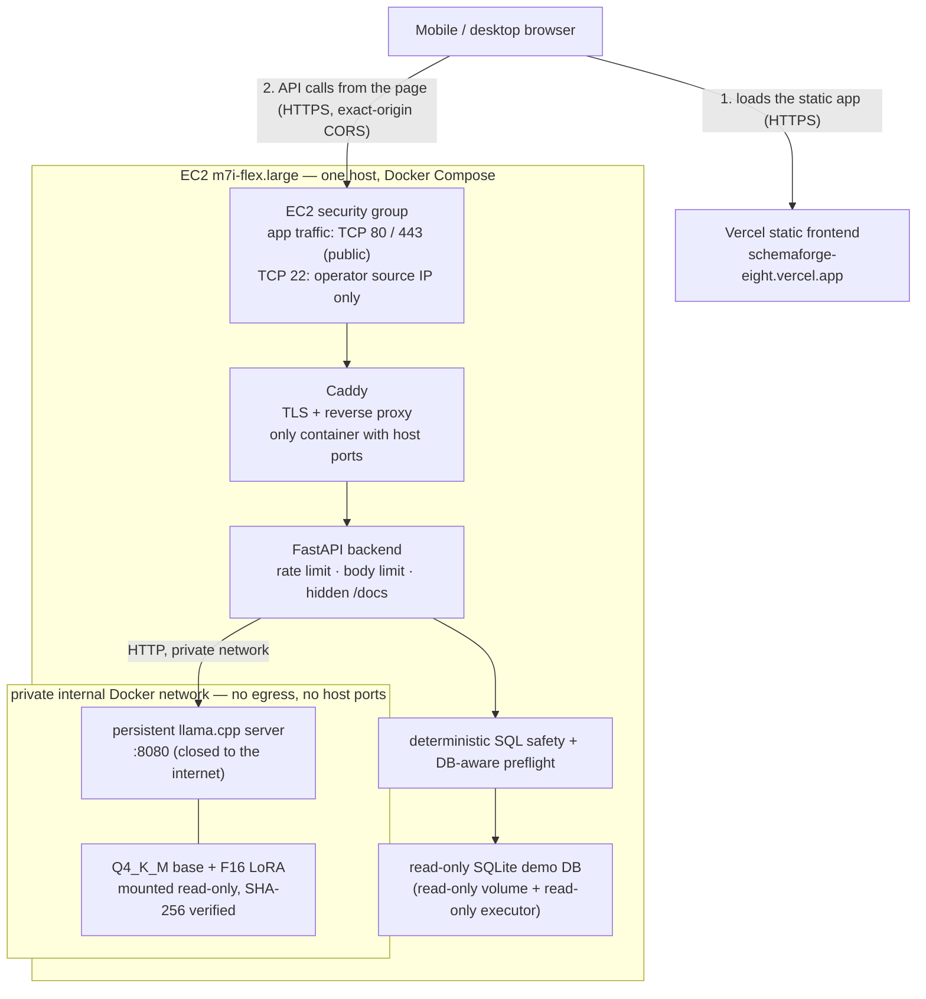
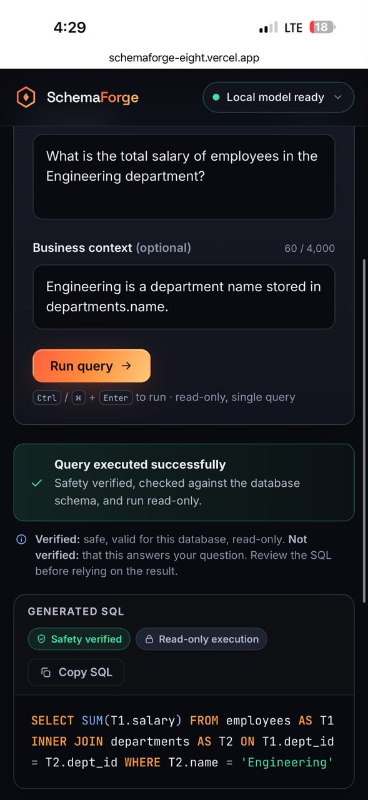

# Phase 11 — Remote production proof (evidence record)

> **Status: PASSED, then intentionally torn down.** This is a point-in-time record of one
> deployment. The backend hostname below (`98-93-31-228.sslip.io`) was **temporary and is
> RETIRED**: the EC2 proof instance was terminated after the final evidence was captured
> (2026-09-19 23:55:16 UTC capture; teardown completed afterwards). The system
> can be recreated from the runbook in [`docs/PHASE11.md`](../PHASE11.md#7-deployment-runbook-as-actually-performed).
>
> This document is **deployment validation**, not a model benchmark. It says nothing about
> accuracy, and nothing here changes any research result (see [§9](#9-what-this-is-and-is-not)).

Raw evidence (local, git-ignored, not committed):
* `.artifacts/phase11/phase11-remote-production-proof.txt` — main capture, **2026-09-19 23:35:22 UTC**;
* `.artifacts/phase11/phase11-final-production-evidence.txt` — final capture before teardown,
  **2026-09-19 23:55:16 UTC** (exact deployed source, manual artifact verification, health/CORS/frontend re-check).

Every fact below is quoted from those files or the screenshots, or marked as operator-reported / derived.

## 1. What was deployed

| Item | Value | Source |
|---|---|---|
| Repository | SchemaForge (this repository) | — |
| Deployed commit | `d51d36a98183353b42e0f73d550723028bce1d64` (`Phase 11: add persistent serving and cloud deployment`), checked out **detached** (`## HEAD (no branch)`): a pinned commit, not a moving branch | final raw evidence |
| Frontend | Vite SPA on Vercel: `https://schemaforge-eight.vercel.app` (stable production URL) | raw evidence |
| Frontend build config | `VITE_API_BASE_URL` → the AWS HTTPS backend; `VITE_QUERY_TIMEOUT_MS=300000` | operator-reported |
| Backend (TEMPORARY, RETIRED) | `https://98-93-31-228.sslip.io` — free `sslip.io` name for the instance's public IPv4, TLS by Caddy/Let's Encrypt | raw evidence |
| Host | AWS EC2 `m7i-flex.large`, us-east-1c, Ubuntu 26.04 LTS x86_64, kernel `7.0.0-1006-aws`, 2 vCPU, 7.6 GiB usable RAM (8 GiB class), 28 GiB usable root filesystem (30 GiB gp3), 4 GiB swap | raw evidence |
| Accelerator | **None.** CPU-only inference, `LLAMA_NGL=0` | raw evidence |
| Container toolchain | Docker 29.8.1, Docker Compose v5.5.1 | raw evidence |
| Images | `schemaforge-backend:local`, `schemaforge-model-server:local` (built on the host from the checkout), `caddy:2.8-alpine` | raw evidence |
| Model server base image | pinned `ghcr.io/ggml-org/llama.cpp:server-b10964` (the llama.cpp build used for the Phase 7 measurements) | repository (`docker/model-server.Dockerfile`) |

### Model artifacts (frozen, mounted — never in Git or in an image)

| File | SHA-256 (as printed on the host) |
|---|---|
| `base-Q4_K_M.gguf` (Qwen3-4B-Instruct-2507, Q4_K_M) | `3df3d5bfa7290f20e8b0ad2b9bae78aa06fb198b97837e4ebc28b5867851c848` |
| `lora-1518-f16.gguf` (QLoRA checkpoint-1518, F16 GGUF) | `53ee2c6dd036ebcccdf0c71bf682c961244ca4665e0cc53bd809ac98b944ba48` |

These match the frozen hashes recorded in [`docs/PHASE7.md`](../PHASE7.md) (base Q4_K_M and LoRA GGUF) and
the local `SHA256SUMS` produced before transfer. Served as a Q4_K_M base plus a hot-loaded
LoRA (`deployment_mode: hot_lora`), exactly the Phase 7 deployment shape.

**Integrity verification — passed.** The final capture ran the manual check from inside the
models directory (`cd /opt/schemaforge/models && sha256sum -c SHA256SUMS`):

```
base-Q4_K_M.gguf: OK
lora-1518-f16.gguf: OK
```

and printed the two digests above. In addition, the model-server entrypoint enforces the same
check on every start when `VERIFY_SHA256=1` and refuses to start on a mismatch
(`docker/model-server-entrypoint.sh`); the model server was `Up … (healthy)` with `restart_count=0`.

*Earlier attempt, recorded for completeness:* the first capture contains a `sha256sum -c` that
printed `FAILED open or read` for both files. That was an operator working-directory mistake (run
outside `/opt/schemaforge/models`, while `SHA256SUMS` lists bare file names), **not** a hash
mismatch; the correct run above supersedes it and the runbook now says to `cd` first.

### Production configuration (values from the host `.env`)

```
SCHEMAFORGE_DOMAIN=98-93-31-228.sslip.io        # RETIRED
SCHEMAFORGE_CORS_ORIGINS=https://schemaforge-eight.vercel.app
MODEL_DIR=/opt/schemaforge/models
BASE_GGUF_NAME=base-Q4_K_M.gguf
LORA_GGUF_NAME=lora-1518-f16.gguf
VERIFY_SHA256=1
LLAMA_NGL=0    LLAMA_THREADS=2    LLAMA_PARALLEL=1    LLAMA_CTX=8192
MODEL_TIMEOUT_SECONDS=240
```

## 2. Topology and boundaries



The frontend is static: the browser loads it from Vercel and then calls the backend API
directly (there is no server-side hop through Vercel). Backend `:8000` and model server `:8080` are container-internal only. The backend is the
application boundary; the model server is unreachable from outside Docker.

## 3. Health, readiness and TLS (captured on the host)

| Check | Result |
|---|---|
| `http://<host>/` | `HTTP/1.1 308 Permanent Redirect` → `https://98-93-31-228.sslip.io/` (Server: Caddy) |
| TLS certificate | subject `CN=98-93-31-228.sslip.io`, issuer Let's Encrypt (`CN=YE2`), valid 2026-09-19 22:10:24 → 2026-12-18 22:10:23 GMT |
| `GET /health` | 200 — `runtime: llama_server`, `runtime_mode: persistent_server`, `deployment_mode: hot_lora`, `context_size 8192`, `max_new_tokens 512`, `seed 42`, `n_gpu_layers 0`, `parallel_slots 1`, `sampling: greedy`, `ready: true` |
| `GET /ready` | 200 — `ready: true`, `reasons: []`, gate `idle` (0 running / 0 waiting, max 1 / 2), `serving.state: ready`, checks `server_configured`, `server_reachable`, `model_ready` all `true` |
| Restarts at capture | model-server `restart_count=0` (up since 23:02:53 UTC), caddy `restart_count=0`, backend `restart_count=0` (up since 23:24:12 UTC) |
| Container status | backend `Up (healthy)`, model-server `Up (healthy)`; **host ports published only by Caddy (80, 443)**; backend `8000/tcp` and model server `8080/tcp` shown as container-internal |
| Resource snapshot (idle, after serving) | model-server 3.656 GiB, backend 59.95 MiB, caddy 12.05 MiB; host `free`: 4.4 GiB used, 3.2 GiB available, swap 92 KiB used |

## 4. `deploy/aws/verify_stack.sh` result

```
[PASS] GET /health -> 200
[PASS] model server ready
[PASS] demo database registered
[PASS] /docs hidden in production
[PASS] port 8080 closed
[PASS] port 8000 closed
```

## 5. CORS proof

Preflight from the production frontend origin returned exactly that origin:

```
HTTP/2 200
access-control-allow-origin: https://schemaforge-eight.vercel.app
access-control-allow-methods: GET, POST
access-control-allow-headers: Accept, Accept-Language, Content-Language, Content-Type, X-Request-ID
access-control-max-age: 600
vary: Origin
strict-transport-security: max-age=31536000
x-content-type-options: nosniff
```

No wildcard: with `SCHEMAFORGE_ENV=production` the backend refuses to start unless the
allow-list is explicit `https://` origins (`validate_production_cors`, covered by
`tests/backend/test_phase11_public.py`). No credentials are allowed. The Vercel frontend
itself answered `HTTP 200` at `https://schemaforge-eight.vercel.app/`.

## 6. Security posture

| Control | How it is established |
|---|---|
| Only application ports 80/443 internet-facing; 8000 and 8080 closed (SSH 22 was administrative and source-restricted, see below) | `verify_stack.sh` PASS on both ports; container port table (only Caddy publishes host ports) |
| Automatic HTTPS, HTTP→HTTPS redirect | 308 response and Let's Encrypt certificate above |
| Model server private | compose: `model` network is `internal: true`, model-server has no `ports:`; verified locally during implementation that it had no outbound route |
| Exact-origin CORS, no wildcard | preflight above + startup validation |
| `/docs`, `/redoc`, `/openapi.json` hidden | `verify_stack.sh` PASS |
| Container hardening | from `docker-compose.yml`: `cap_drop: ALL`, `no-new-privileges`, non-root user (uid 10001) in the backend and model-server images, read-only backend root filesystem, read-only mounts for models and for the SQLite volume, no `privileged` |
| Artifacts outside Git/images, integrity-checked | GGUFs mounted from `/opt/schemaforge/models`; manual `sha256sum -c` **OK** for both files (final capture) plus entrypoint SHA-256 verification at start (§1) |
| Public-demo limits | per-client rate limit (`RATE_LIMIT_PER_MINUTE`, compose default 20), 64 KB body cap at Caddy plus declared-length check in the backend, Caddy as the single trusted proxy hop |
| SQL safety | deterministic AST safety policy → DB-aware preflight → independent read-only SQLite executor (Phases 8 and 10) |
| SSH restricted to the administrator's source IP; IMDSv2 required; no NAT gateway, load balancer, RDS, Route 53 hosted zone, Elastic IP or GPU | **operator-reported** for this deployment; AWS console settings are not part of the raw evidence file |

## 7. External mobile proof

An iPhone on **LTE / mobile data with Wi-Fi disabled** (status bar shows `LTE`) opened
`https://schemaforge-eight.vercel.app`, i.e. a device and network independent of the
development laptop. The status pill read **"Local model ready"** — that label means the
self-hosted open-weight model (as opposed to a third-party API), not a model running on the phone.

| Input | Value |
|---|---|
| Question | `What is the total salary of employees in the Engineering department?` |
| Business context | `Engineering is a department name stored in departments.name.` |

Generated SQL (as shown in the UI; raw evidence lists it on one line):

```sql
SELECT SUM(T1.salary)
FROM employees AS T1
INNER JOIN departments AS T2
ON T1.dept_id = T2.dept_id
WHERE T2.name = 'Engineering'
```

Result: **`625,000`**, 1 row — the value the deterministic demo database yields for that question
(the same fixture answer as in the Phase 10 and Phase 11 canaries). The UI reported "Query
executed successfully", "Safety verified", "Read-only execution".

The UI's own caveat applies and is reproduced deliberately: *"Verified: safe, valid for this
database, read-only. **Not verified:** that this answers your question."* The safety and preflight
stages do not establish semantic correctness, and no confidence score is claimed
(`reliability.semantic_correctness = "not_verified"`, `confidence = null`).

| Screenshot | |
|---|---|
| Question, context, success banner, generated SQL |  |
| Result and timing chips |  |

### One observed production request — not a benchmark

| Observed on that single request | Value |
|---|---|
| Total | 16.0 s |
| Generation | 16.0 s |
| Execution | < 1 ms |
| Rows | 1 |
| Generation speed shown by UI | 3.4 tok/s |

This is **one** request on a CPU-only 2-vCPU host with `LLAMA_THREADS=2`, in a proof run that
deliberately favoured low cost over latency. It has no repeats, no percentile, no warm/cold
separation and no load. Do not read it as a latency or throughput claim, and do not compare it
with the local measurements in [`docs/PHASE7.md`](../PHASE7.md) (different hardware, thread
count and methodology).

## 8. Why it was terminated, and how to get it back

The proof deployment existed to answer one question — *can this system be run end to end on real
public cloud infrastructure by someone other than the development laptop?* — at
near-zero cost. Once the final evidence was captured the EC2 proof instance was terminated (completed after
the 23:55:16 UTC capture) so nothing keeps running or billing, and the temporary `sslip.io` hostname (which
encodes the instance IP) was retired with it. The static Vercel frontend may remain deployed, but it
cannot serve model queries without a recreated backend.

Recreate it from the checked-in runbook (`docs/PHASE11.md` §7): launch an 8 GiB x86 Ubuntu host,
run `deploy/aws/bootstrap_ec2.sh`, `scp` the two GGUFs and `SHA256SUMS`, fill `.env` from
`deploy/production.env.example`, `docker compose up -d --build`, run `deploy/aws/verify_stack.sh`,
and repoint Vercel's `VITE_API_BASE_URL` (a new IP means a new `sslip.io` name, so update
`SCHEMAFORGE_CORS_ORIGINS` only if the Vercel origin changed).

## 9. What this is and is not

| | |
|---|---|
| **Measured research results** (BIRD baseline, fine-tuned evaluation, quantization checks) | Documented in `docs/BASELINE.md`, `docs/TRAINING.md`, `docs/PHASE7.md` and `PROJECT.md`. **Unchanged by Phase 11.** |
| **Deployment validation** (this document) | Health/readiness, TLS, CORS, closed ports, artifact identity, an external mobile query. Shows the system *runs* as designed on public infrastructure. |
| **One-off observed timing** | The 16.0 s / 3.4 tok/s figures above. Illustrative only. |
| **Not shown** | Accuracy of the deployed model, quality of Q4_K_M vs F16 beyond Phase 7's stated non-claim, throughput under concurrency, availability/uptime, GPU behaviour, multi-user load. |

Known limits of the evidence, listed so nothing is overstated: security-group rules, IMDSv2 and the
absence of NAT/load balancer/RDS/Elastic IP/GPU are operator-reported (AWS console settings are not
in the raw files); and the timing figures come from the UI, not from a server-side trace.
